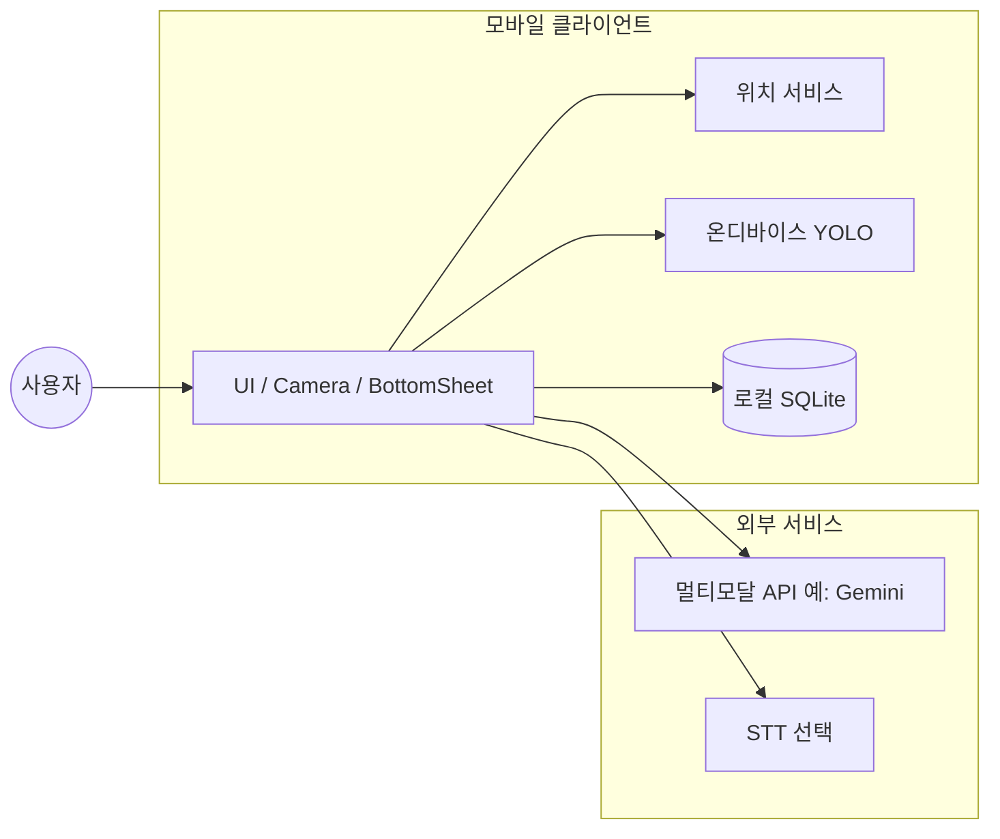
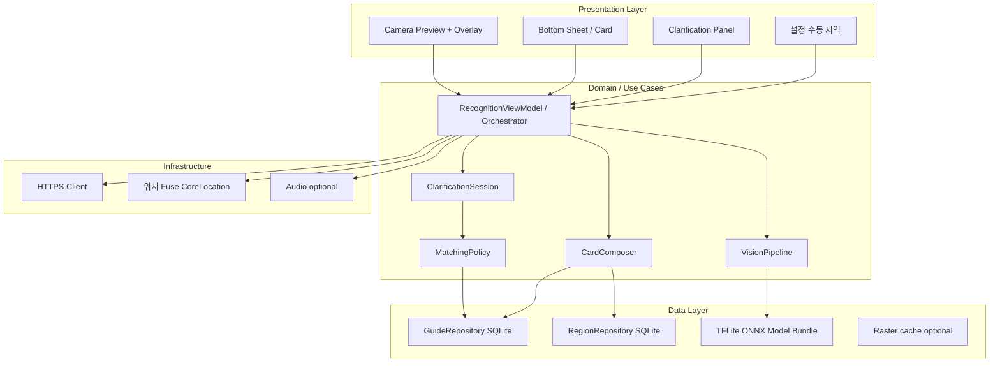
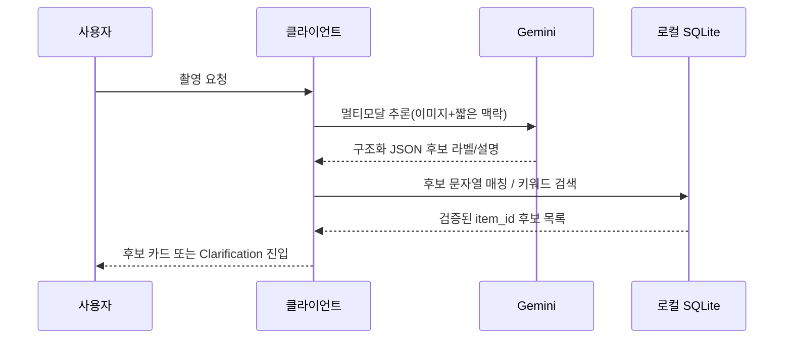

# TrashAI — 아키텍처 (Architecture)

| 항목 | 내용 |
|------|------|
| 제품 | TrashAI · 재활용 배출 가이드 모바일 앱 |
| 관련 문서 | `PRD.md`, `problem.md`, `docs/vision.md`, `docs/scenario.md` |
| 상태 | 초안 (PRD Draft 정합) |
| 대상 플랫폼 | Android 우선, iOS 확장 고려 |

---

## 1. 아키텍처 목표

- **오프라인 우선(OFFLINE-FIRST)에 가깝게**: 품목·지역 조례 등 **정제된 가이드 텍스트는 기기 내 DB**에서 읽어 카드를 구성한다.
- **지연·비용 분리**: 라이브 카메라는 **온디바이스 비전(YOLO 계열)** 에 맡기고, 고비용·불확실 구간만 **클라우드 멀티모달(Gemini 등)** 으로 보완한다.
- **단일 진실 소스(Single source of truth for copy)**: 카드에 보이는 최종 문구는 가능한 한 `app_item_rule` / `app_region_ordinance` 같은 **앱용 테이블**에서만 조합한다 (LLM 자유 생성문을 그대로 신뢰 문구로 쓰지 않는다).
- **불확실성은 대화로 수렴**: 낮은 신뢰도·사용자 거부 시 **Clarification 플로우**로 `item_id`(또는 동등 키)를 하나로 확정한 뒤 동일 카드 파이프라인을 탄다.

---

## 2. 시스템 맥락 (Context)

- **사용자**는 카메라·터치(·선택적으로 음성)로 앱과 상호작용한다.
- **기기**에서 위치·비전·로컬 데이터 조회가 이루어진다.
- **클라우드**는 촬영 기반 정밀 분석·(선택) STT·대화 수렴 보조에만 사용하고, **네트워크 실패 시 로컬 폴백**이 가능하도록 설계한다.

---

## 3. 논리 컨테이너 (모바일 내부)

| 레이어 | 역할 |
|--------|------|
| Presentation | 픽토그램·큰 글자·네온 박스 등 PRD 레이아웃. 상태: `Scanning`, `Locked`, `Uncertain`, `Clarifying`, `GuidanceReady`. |
| Domain | “무엇을 버리는 물건인가” 확정까지의 결정 순서와 **카드를 조립할 재료**(item_id, region_id, 카피 블록)를 만든다. |
| Data | SQLite·번들 모델·(선택) 자산 로딩만 담당. 비즈니스 문장 조합은 Domain에 유지한다. |
| Infrastructure | Gemini/STT 호출·권한·재시도·프라이버시 동의 흐름. |

---

## 4. 핵심 데이터 플로우

### 4.1 기본 플로우 (카메라 → 카드)

1. 프레임 입력 → **YOLO** 검출 · 클래스 신뢰도 산출.  
2. 다중 검출 시 **중앙/면적/신뢰도 우선 규칙**(PRD M-5) 적용 후 **대표 타깃 하나** 선택.  
3. `VisionResult`와 현재 행정구역 키로 **CardComposer** 호출:
   - `app_item_rule`에서 품목 요약·배출 문구 후보 로드  
   - `app_region_ordinance`에서 **조례/지역 근거 맥락**(필요 시 접이식) 로드 — 품목 세부 규칙 오버레이와는 별도 테이블이므로 카드에서는 “참고/근거” 절로 배치 가능  
   - 배출 요일·로컬 팁은 향후 `region_calendar` 같은 별 테이블이 생기면 동일 패턴으로 결합(PRD 미구현 분)
4. UI는 **항상 출처 크레딧**(PRD B-6)을 노출.

### 4.2 촬영 기반 폴백 (Gemini 등)

원칙: **외부 모델의 자연어 결과를 카드 단일 소스로 쓰지 않고**, `item_id`(또는 동등 행)**가 존재하는지** 검증 후 조회한다.

### 4.3 Clarification 플로우 (불확실 또는 사용자 거부)

- **진입**: 신뢰도 하한 미만 · 상위 K개 점수 격차 축소 · 사용자 “틀림” 또는 반복 재촬영 등(PRD C-1).  
- **세션**: 짧은 턴(질문 카드 또는 칩 선택) + 선택적 텍스트/음성.  
- **MatchingPolicy**가 수행해야 할 일:
  1. 선택지 라벨 → `app_search_keyword` / `dictionary_item(title)` 검색 트라이 또는 FTS(구현 선택)  
  2. (선택) LLM에게 **허용된 후보 목록만** 제공해 순위 재정렬 (**리스트 바깥 ID 생성 금지**)  
  3. 상위 후보 미검증 시 **안전 문구 + 링크/문의**(PRD·problem 정합)
- 확정 후 기본 플로우와 **동일 CardComposer 경로**로 합류.

---

## 5. 로컬 데이터 저장소 개요

빌드 파이프라인은 `scripts/` 참고. 실행 시 포함하는 파일 예: `data/wasteguide_dictionary.sqlite3`.

| 표(개요) | 앱 역할 |
|----------|---------|
| `dictionary_item` | 원본 품목사전(HTML/텍스트). 디버깅·리프레시·재정제 원천. |
| `region` / `region_ordinance` | 지역별 조례 블록 텍스트(참조·근거). |
| `app_item_rule` | **품목 카드 카피**(요약·배출 방법 등) — UI의 1순 조회 원천. |
| `app_region_ordinance` | **지역 조례 카드 카피** — 카드 접이 섹션·근거 레이블. |
| `app_search_keyword` | Clarification 검색색인(단순 키워드 연결 가중치). |

앱 패키지에 넣기 전 빌드 스텝 예: `scripts/finalize_app_db.py` 실행 및 산출 DB를 `assets/`에 복사.

---

## 6. 신뢰도·품질·관측

- **Confidence gate**: 라이브 YOLO 임계값을 설정 파일(`RemoteConfig`/로컬 JSON)으로 분리 가능.  
- **로깅(PII 금지)**: 세션 종료 상태, 선택된 `item_id`, Clarification 턴 수, Gemini 호출 여부만 통계 가능. 원본 영상 업로드는 옵션·동의 기반으로만.

---

## 7. 보안·프라이버시 요약

- 이미지·음성 업로드는 **명시 동의 후** 발생. 디폴트는 비보관 처리.  
- 외부 API로 보내는 페이로드에는 **좌표·세션 최소값** 외 과잉 정보를 포함하지 않는 것을 목표로 한다.  
- LLM 결과는 반드시 **DB 검증** 후 사용자에게 신뢰 문구 형태로 제시(PR 리스크).

---

## 8. 배포 관점 및 확장

- **모델 갱신**: 앱 업데이트 또는 OTA 패키지(벡터 무게)·버전 헤더(`model_version`).  
- **DB 갱신**: 주기적으로 번들 교체 또는 delta SQLite 패치 배포 가능. 크롤/정제 작업은 PC에서 수행 후 앱 재배포.  
- **iOS 포팅 시**: Domain/Data 경계 동일하게 유지, CameraX → AVFoundation 교체뿐 플랫폼 레이어만 이식하면 된다.

---

## 9. 미결정 과제 — 아키 결정 필요

백엔드 자체 호스트 여부, Gemini 대체 모델, STT 제공자(`P1`), 배출 요일 데이터 소스별 테이블 설계(PR `B-5`). 이 문서에는 **패턴**(Repository + 카드 Composer)까지만 명시했다.

---

## 변경 이력

- **v1 (2026-05-14)**: 초안 작성 — PRD 대화형 Clarification 포함.
